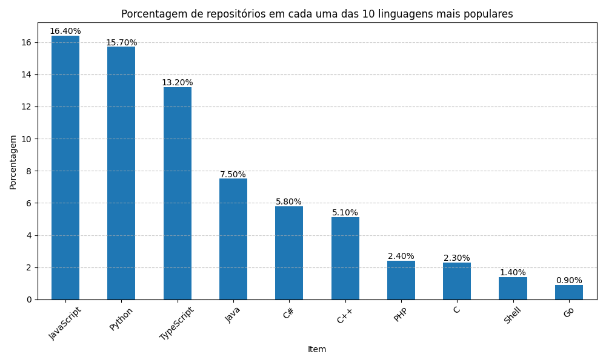

# LAB 1 -  Análise dos 1000 repositórios mais populares do Github

## i. Introdução

Neste trabalho são analisados os 1000 repositórios mais populares do Github de acordo com a sua quantidade de *stars*. O intuito é observar padrões comuns entre estes repositórios, que por sua vez possuem uma grande variedade de propósitos, podendo se tratar de sistemas *open source*, repositórios para conhecimento (livros, artigos, aulas) assim como bibliotecas, e estes são apenas alguns dos exemplos do que pode ser encontrado dentre os repositórios analisados.

## ii. Metodologia

Para realizar este trabalho foi criado um algoritmo que realiza a busca dos 1000 repositórios mais populares do Github utilizando sua interface GraphQL. A busca é dividida em 40 páginas de 25 itens cada, sendo cada requisição realizada com um intervalo arbitrário de 8 segundos entre cada uma. Cada uma das páginas de resultados é acrescentada a uma lista, e assim que a obtenção dos dados é finalizada com sucesso é criado um arquivo `github_repositories_data.csv` contendo estes dados.

Durante este processo é realizada a detecção de qual linguagem de programação é utilizada por cada repositório e é criada uma lista com todas as linguagens utilizadas pelos repositórios analisados, sendo esta lista salva em um arquivo `language_list.txt`. Também é salvo o mapeamento do index de cada uma das 10 linguagens mais populares presentes na lista salva em `language_list.txt`, e este mapeamento por sua vez é salvo em `most_popular_languages_indexes.txt`.

Após obter todos os dados necessários, é realizado o processo de análise sobre esses dados. Primeiramente os dados do arquivo `.csv` são carregados para um *Data Frame* da biblioteca panda, e os dados dos arquivos `.txt` são carregados para duas listas distintas. Após isso são calculadas as medianas necessárias para responder as perguntas destas pesquisas. 

Em sequencia é calculada a porcentagem dos repositórios analisados que utilizam uma das 10 linguagens mais populares, e após esse calculo é gerado um gráfico que ilustra tais dados.

## iii. Resultados

### RQ 01. Sistemas populares são maduros/antigos?

Métrica: idade do repositório (calculado a partir da data de sua criação)

R: Pela analise realizada é possível dizer que sim, pois a mediana calculada indica um periodo de existencia dos repositórios de `97 meses, 16 dias, 5 horas, 5 minutos e 19 segundos`. 

Para responder esta pergunta, foi calculada a mediana da coluna `time_since_created_at_in_seconds` presente em `github_repositories_data.csv` e foi realizada uma transformação do valor bruto (dado em segundos) para a string apresentada com meses, dias, horas, minutos e segundos.

### RQ 02. Sistemas populares recebem muita contribuição externa?

Métrica: total de pull requests aceitas

R: Pode-se dizer que sim, pois a mediana da quantidade de *pull requests* aceitas dos repositórios analisados é de `578,5` e se levarmos em consideração também a mediana de idade dos repositórios isso nos dá uma média de `aproximadamente 72 pull requests por ano`, sendo este um número considerável.

Para responder esta pergunta, foi calculada a mediana da coluna `pull_requests_accepted` presente em `github_repositories_data.csv`.

### RQ 03. Sistemas populares lançam releases com frequência?

Métrica: total de releases

R: Não, pois a mediana da quantidade de releases dos 1000 repositórios analisados é apenas `30`, e se levarmos em consideração também a mediana de idade dos repositórios isso nos dá uma média de apenas `cerca de 3,75 releases por ano`. Se removermos da equação aqueles repositórios com 1 ou menos releases, sendo esses repositórios geralmente relacionados a conteudos de estudo e coisas similares, obtemos a mediana de `80` releases, o que daria `cerca de 10 releases por ano`, já sendo este um valor mais considerável.

Para responder esta pergunta, foi calculada a mediana da coluna `releases_count_median` presente em `github_repositories_data.csv`. Após isso, foi realizada a mesma análise porém em uma versão dos dados de `github_repositories_data.csv` que excluia itens com 1 ou menos releases.

### RQ 04. Sistemas populares são atualizados com frequência?

Métrica: tempo até a última atualização (calculado a partir da data de última
atualização)

R: Pela analise realizada é possível dizer que sim, pois a mediana calculada indica a ocorrencia de atualizações repositórios há menos de `2 horas, 8 minutos e 25 segundos`. 

Para responder esta pergunta, foi calculada a mediana da coluna `time_since_last_update` presente em `github_repositories_data.csv` e foi realizada uma transformação do valor bruto (dado em segundos) para a string apresentada com meses, dias, horas, minutos e segundos.

### RQ 05. Sistemas populares são escritos nas linguagens mais populares?

Métrica: linguagem primária de cada um desses repositórios

R: Sim, ao realizar a análise de quantos dos 1000 repositórios analisados utilizam uma das 10 linguagens mais populares atualmente foi obtido o resultado de que aproximadamente `70,1% destes repositórios está utilizando uma dessas 10 linguagens`, se tratando de um número altamente expressivo. Vale adicionar também que `as 3 linguagens mais populares (JavaScript, Python e Typescript) compõem 45,3% dos repositórios analisados`.

### RQ 06. Sistemas populares possuem um alto percentual de issues fechadas?

Métrica: razão entre número de issues fechadas pelo total de issues 

R: Sim, a mediana nos indica que cerca de 86,81% das issues dos repositórios analisados são fechadas.

Para responder esta pergunta, foi calculada a mediana da coluna `closed_issues_ratio_median` presente em `github_repositories_data.csv`.

### RQ 07: Sistemas escritos em linguagens mais populares recebem mais contribuição externa, lançam mais releases e são atualizados com mais frequência?

R: Não. Após analisar os dados com relação aos fatores acima separados por linguagem, é possível perceber que não necessáriamente as 10 linguagens mais populares figuram entre o Top 10 entre as linguagens com maior frequência de contribuição externa. O mesmo é valido quando questionamos a quantidade de releases lançadas e a frequência de atualização.

